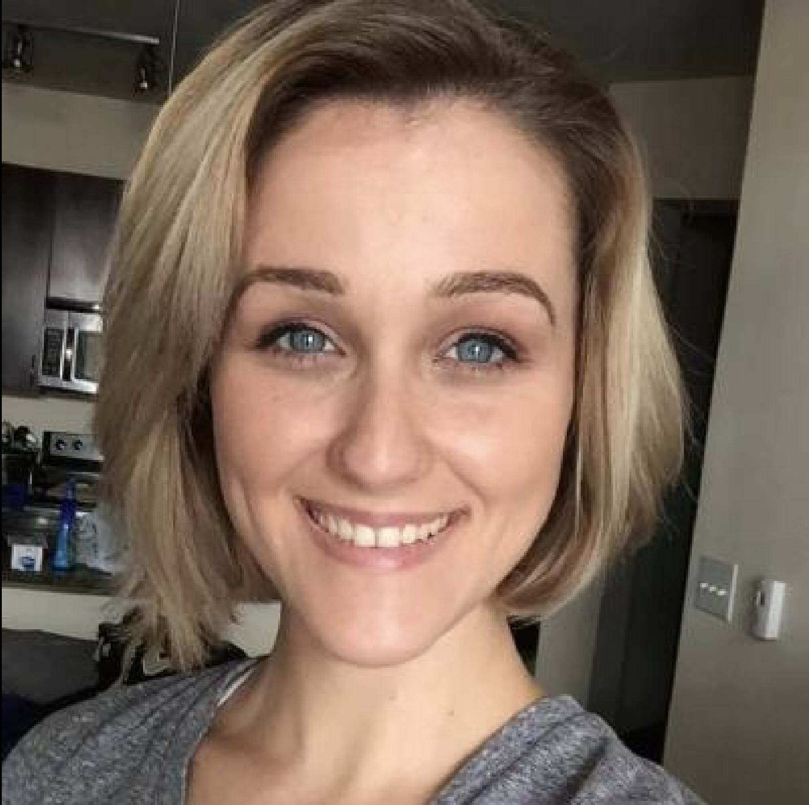

# Lauren Collins - Technical Project Manager & Full Stack Software Developer 

## Portfolio

1. **Invest in Moms for Smarter Kids**  
   - [Video Demo](https://youtu.be/_CuoAfAozsQ?si=tFwzSCvvpoZATqCe)  
   - [Source Code](https://github.com/LaurenC2022/-Invest-in-Moms-for-Smarter-Kids.git)  
   - **Description:** An information visualization project leveraging data analysis to explore the impact of mothers on child development. Built using Python.  

2. **Rivest-Shamir-Adleman Algorithm**  
   - [Source Code](https://github.com/LaurenC2022/encryption_RSA)  
   - **Description:** A Python program implementing the Rivest-Shamir-Adleman algorithm to encrypt and decrypt messages.  

3. **Book Bag: Full-Stack Web Application**  
   - [Source Code](https://github.com/LaurenC2022/Team_6_Group_Project.git)  
   - **Description:** A web application designed to assist users in researching and organizing books. Users can create accounts, save book titles, and access them later. Built with a team of developers using agile development methodologies and includes a database for user data storage. 

## Education

- **Bachelor of Science in Applied Computer Science**  
  *University of Colorado - Boulder*  
  - **Duration:** January 2024 – Present  
  - **GPA:** 3.824  
  - **Courses Completed:**  
    - Data Structures (A-)  
    - Software Development Methodologies (A)  
    - Information Visualization (A-)  

- **Bachelor of Science in Teaching and Learning**  
  *University of Houston*  
  - **Graduated:** May 2020  
  - **GPA:** 3.08  

## Work Experience

- **Math Teacher**  
  - Developed and delivered engaging math lessons for middle and high school students, fostering academic growth and critical thinking skills.  
  - Utilized innovative teaching strategies and technology to improve student performance and engagement.  
  - Built strong relationships with students, parents, and colleagues to create a positive and collaborative learning environment.  
  - Reason for leaving: Relocated due to spouse's work.
 
- **Project Manager and Marketing Intern at a Software Development Company, Shanghai, China**  
  - Collaborated with new clients to gather their website requirements.
  - Worked with designers and developers to fulfill client expectations. 
  - Conducted testing and resolved issues to ensure quality delivery.  

## Lets Connect 

- [LinkedIn](https://www.linkedin.com/in/laurencollins1190/)
- [Microsoft Learn](https://learn.microsoft.com/en-us/users/laurencollins-7920/)
- [Twitter](https://twitter.com/Home_At_Heart_)
- [GitHub](https://github.com/LaurenC2022)
- [StackOverFlow](https://stackoverflow.com/users/17926621/lauren-collins)
- [LeetCode](https://leetcode.com/u/NWsbAqZV89/)

 

## Community Involvement  

- **Virtual Coffee**  
  - Actively participate in weekly developer meetups and discussions.  
  - Share insights and knowledge through lightning talks and blog posts.  
  - Mentor and support newcomers in navigating their career paths.  

- **codebar**  
  - Workshop lead, collaborating with organization leadership to tailor workshops to attendee needs.  
  - Assist learners in building confidence and developing coding skills.  
  - Contribute to fostering an inclusive and welcoming learning environment.  

## Skills Stack

### College Experience  

- **Programming Languages & Tools:**  
  - HTML, CSS  
  - C++ (Intro to Programming & Data Structures)  
  - Python (Intro to Programming & Information Visualization)  
  - FlasK, Python Framework  
  - Bash Scripting for Web Scraping

- **Development Methodologies:**  
  - Agile Development (Software Development Methodologies)  
  - Test-Driven Development (Software Development Methodologies)  

- **Technical Skills:**  
  - Linux Command Line (Software Development Methodologies)  

---

### Other Experience  

- VS Code IDE  
- Visual Studio  

---

### Future Goals  

- **Programming Languages:** Java, C#, JavaScript, TypeScript  
- **Certifications:** Azure Certifications, Program Management Certification  
- **Technologies:** DevOps, ASP.NET, Nop Commerce, Machine Learning, and AI
- **Academics:** Study advanced math, algorithms and data structures topics
- **Other:** Dabble in WordPress and Figma  

## About Me 

I am passionate about leveraging technology and collaboration to drive impactful projects. Currently, I am preparing for the Certified Associate in Project Management (CAPM) exam through the Project Management Institute.

My background as a middle school math teacher sharpened my ability to communicate complex concepts clearly and collaborate effectively with diverse teams. These skills translate into my role as a technical leader, where I facilitate coding workshops and mentor others within my community. My long-term goal is to contribute to global technical forums and conferences, sharing insights on project management, software architecture, and emerging technologies.

Looking ahead, I aim to deepen my expertise in teaching and expand my impact. Over the next five years, my goals include:

- Earning certification to teach advanced math.

- Become certified to teach computer science and inspire girls and young women to explore the field—more on this later.

- Staying active in coding communities like Virtual Coffee and Codebar, while building projects for fun and growth.

I'm working toward becoming certified to teach computer science, with a special focus on encouraging girls and women to explore the field. I envision leading a hands-on, lab-style classroom where students can dive into foundational topics like command-line tools, basic programming, the Fibonacci sequence, data visualization, recursion, and Bash scripting. To give students a realistic view of the developer experience, we'll use GitHub and incorporate Agile principles throughout the course. I also plan to introduce an algorithm-and-data-structure pair to build their problem-solving skills and computational thinking. To round out the experience, students will complete a project that combines Figma, WordPress, and web hosting—giving them a taste of both design and deployment. My goal is to provide a well-rounded, engaging introduction to computer science that builds confidence and curiosity in every learner. Lastly, we would work with AI as it is the future of tech. 

I am committed to continuous learning and to developing adaptable workflows that keep pace with the rapidly evolving tech landscape. I enjoy teaching math and computer science and look forward to a long, fulfilling career in education—while also pursuing passion projects that challenge and inspire me.

I excel in problem-solving, team coordination, and driving projects to successful completion. By combining technical expertise, project management skills, and a strong teaching background, I create innovative learning experiences that foster personal growth and leave a lasting impact. I teach grades 4–12 professionally and lead adult workshops as a passion project.
    
